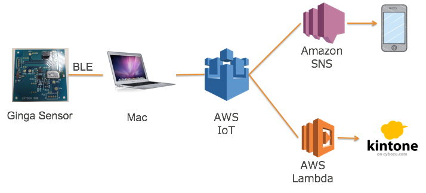

=======================
イントロダクション
=======================

ハンズオンシナリオ
==================

**シナリオ: センサーデータの送信**

Ginga BLEペリフェラルから、IoT GWを通して、AWS IoTのトピックに温度センサーのデータを送信し、AWS IoTでルールに基づきしきい値を下回った場合、E-mailでアラートを送信するようにルールを設定します。また、もう一つのルールを設定し、Lambda経由でデータのモニタリングアプリにデータを流し込むことをいたします。
今回のハンズオンでのデータモニタリングでは、サイボウズ社提供のkintoneを利用いたします。
本ハンズオンにより、AWS IoTの設定方法、各AWSとのインテグレーションを学ぶことができます。

|           

利用するデバイス、アプリケーション、サービス
============================================

**GINGA BLE ペリフェラル**

ネビラボ社が提供するBLEセンサーです。本ハンズオンではセンサーからのデータ取得、AWS IoTへのデータ送信に利用します。
    http://nebulab.co.jp/products/sensornet.html

    ペリフェラルには、温度センサー、湿度センサー、加速度センサーが実装されてます。
    今回のハンズオンでは、温度センサーと湿度センサーを定期的（10秒間隔）にアップロードされます。
    クラウドに上がってくるフォーマットは、以下のとおりです。
    
    ============= ========================================
    key           value
    ============= ========================================
    device        デバイス名
    sensor        センサータイプ（temp = 温度、humid = 湿度）
    timestamp     デバイス側タイムスタンプ
    value         センサーの値
    ============= ========================================
    
|    

**kintone**

kintoneとは、さまざまな業務システムをノンプログラミングでスピーディーに作成できるサイボウズ社のクラウドサービスです。 社内の既存システムとの連携と素早い業務改善を実現します。 さらに、社内のみならず、企業間にまたがる業務にも活用が進んでいます。
    https://kintone.cybozu.com/jp/
    
|    

**AWSアカウント**

AWSコマンドラインでiotおよびiot-dataを実行できるようにご利用のPCの設定をお願いします。
インストールの手順はこちらのとおりです。
    https://aws.amazon.com/jp/register-flow/

|    

**AWS IoT**

接続されたデバイスが安全かつ簡単にクラウドアプリケーションやその他のデバイスとやりとりするためのマネージド型プラットフォームです。本ハンズオンではデバイスからのデータ受信、デバイスのリモート制御などで利用します。
    https://aws.amazon.com/jp/iot/

|    

**Amazon SNS**

Amazon SNSは、モバイルおよびエンタープライズメッセージングの pub-sub サービスで、Mobile Pushやメール、HTTPコールなど複数プロトコルによるメッセージの配信ができます。

    https://aws.amazon.com/jp/sns/

|    

**AWS Lambda**

AWS Lambda を使用すれば、サーバーのプロビジョニングや管理なしでコードを実行できます。課金は実際に使用したコンピューティング時間に対してのみ発生し、コードが実行されていないときには料金も発生しません。Lambda を使用すれば、実質どのようなタイプのアプリケーションやバックエンドサービスでも管理を必要とせずに実行できます。コードさえアップロードすれば、高可用性を実現しながらコードを実行およびスケーリングするために必要なことは、すべて Lambda により行われます。コードは、他の AWS サービスから自動的にトリガーするよう設定することも、ウェブやモバイルアプリケーションから直接呼び出すよう設定することもできます。。

    https://aws.amazon.com/jp/lambda/

|    

