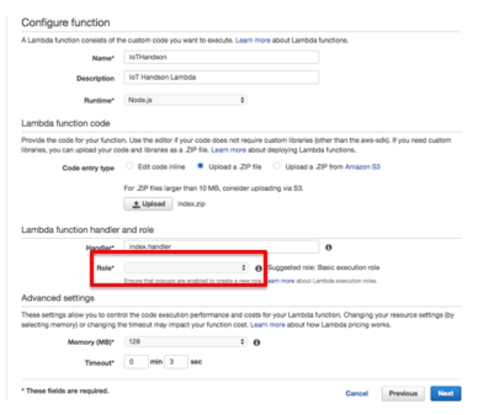
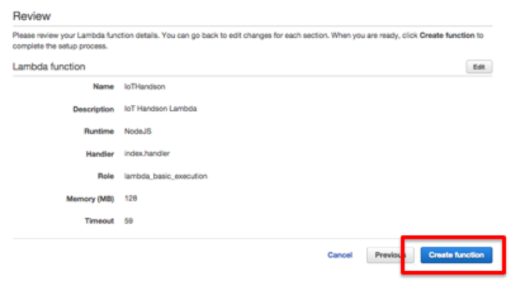

=================
AWS Lambdaの設定
=================

コードのダウンロード
==============
ダウンロード先は別途ご案内いたします。

今回は、コードの修正は必要なのでそのままLambdaに登録できます。
コードのサンプルは以下のとおりです。

.. code-block:: javascript
  :linenos:   

    var request = require('request');
    var moment = require('moment');
    var APP_ID = '';
    var SUBDOMAIN = '';
    
    exports.handler = function(event, context) {
      
        record = {
            'DeviceID': { value: event.device },
            'SensorType': { value: event.sensor },
            'Datetime': { value: event.timestamp },
            'Value': { value: event.value }
        };
    
        request({
            method: 'POST',
            url: "https://" + SUBDOMAIN + ".cybozu.com/k/v1/record.json",
            headers: {
                'X-Cybozu-Authorization': '',
                'Authorization': 'Basic ',
                'Content-Type': 'application/json'
            },
            json: {
                'app': APP_ID,
                'record': record
            }
        }, function(err, response, body) {
            if (err) {
                console.log("err : " + err);
                context.fail('Error');
            }else{
                context.succeed();
            }
        });
    };

AWS Lambdaの設定
==============

AWS Lambdaのコンソールをサービス一覧から選択し、起動します。
改めて東京リージョンであることを確認してください。
"Create a Lambda Function"を選択します。

.. image:: images/6-lambda-create-lambda.png

|           

Select blueprintは、スキップします。

.. image:: images/6-lambda-skip-blueprint.png

|           

Configure Function画面で名前の入力などを行います。Uploadボタンをクリックし、上記でダウンロードしたZipファイルを選択します。
RoleのリストからBasic execution roleを選択します。

|           

ロールを作成する画面に遷移するので、内容を確認して、"許可"ボタンをクリックします。

|           

画面が元のConfiguration Functionに戻り、Timeoutを59秒にして、"Next"ボタンをクリックします。

.. image:: images/6-lambda-conf-func-param.png

|           

確認画面で確認して、"Create Function"をクリックします。

|           

.. image:: images/6-lambda-done.png

|           

AWS IoTのルール設定
==============

Lambdaの登録が終わったので、先ほどのSNSと同様の手段で、Lambdaを設定します。
手順は、SNSとほぼ同等で、Lambdaを選択する部分のみことなります。  
** (注意) 以下の画像とConditionは異なります。**  

.. image:: images/6-iot-lambda-rule.png

|           

これで準備は整いました。
SNSの時と同様10秒単位でセンサーデータがAWS IoTにPublishされてます。
設定がうまく行っていれば、kintoneの障害対応アプリ内にデータが蓄積されます。

kintoneのアプリで確認
==============

5章でアクセスしたアプリ内で自分のデバイスIDのログが入力されているか確認します。
参加者皆さんのデータが蓄積されますので、適宜フィルターなどをかけて見てください。

