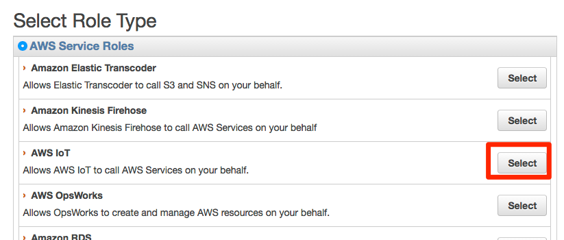
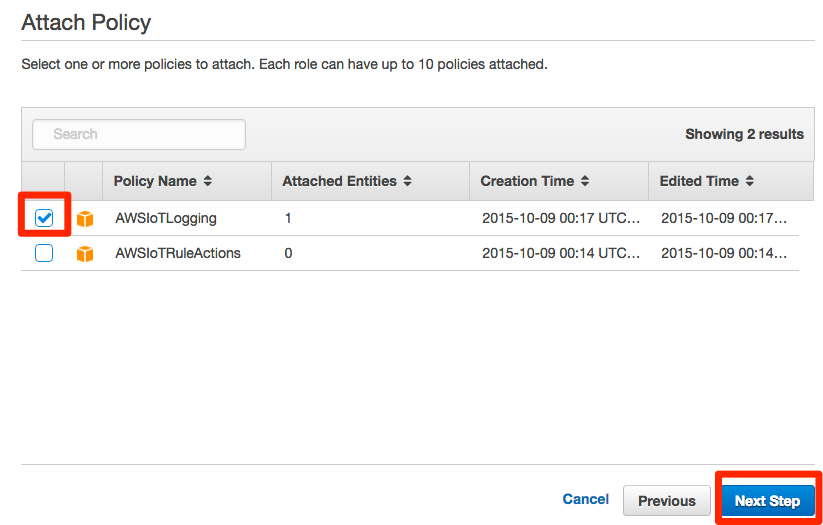
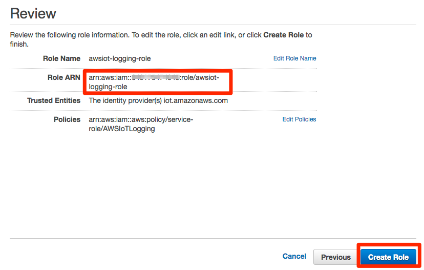

===================================
その他の設定（オプション）
===================================

GINGA BLE ペリフェラルについて
=====================

ペリフェラルには、温度センサー、湿度センサー、加速度センサーが実装されてます。
今回のハンズオンでは、温度センサーと湿度センサーを定期的（10秒間隔）にアップロードされます。

**動作方法**

    電池を入れて(1つでもOK)、電池ソケットと反対側に小さなスライドスイッチがあり、スイッチをON(シルクされていない方)にすると動作開始します。  
    センサデータは、BLEからNotificationで通知されます。BLEセントラルから接続後、NotificationをEnableにすると、データが、約10秒間隔で取得できます。  

**データフォーマット**

    0x00 TEMP[15:8] *1  
    0x01 TEMP[7:0] *1  
    0x02 HUM[15:8] *1  
    0x03 HUM[7:0] *1  
    0x04 ILLUMI_OUT[7:0]  
    0x05 ACCEL_X_OUT[15:8] 加速度x軸  
    0x06 ACCEL_X_OUT[7:0]  
    0x07 ACCEL_Y_OUT[15:8] 加速度y軸  
    0x08 ACCEL_Y_OUT[7:0]  
    0x09 ACCEL_Z_OUT[15:8] 加速度z軸  
    0x0a ACCEL_Z_OUT[7:0]  
    0x0b TOBJ_OUT[15:8] 赤外線温度 16bitのdouble  
    0x0c TOBJ_OUT[7:0]  
    0x0d PERI_ID[7:0] *2  
    
*1 TEMP(温度[摂氏])とHUM(湿度[%])は 整数部(上位バイト)と少数部(下位バイト)に分かれています  
*2 16bitのdouble *peripheral ID  

CloudWatch Logsの設定
=====================

AWS IoTのログはCloudWatch Logsで取得可能です。
詳細な手順はこちらに掲載されています。

http://docs.aws.amazon.com/ja_jp/iot/latest/developerguide/cloud-watch-logs.html

まず、メニュー画面から"Identity & Access Management"をクリックし、IAMの設定画面を表示します。画面左のメニューから"Roles"をクリックし、[Create New Role]をクリックします。

.. image:: images/7-logs-1.png

|

"Role Name"にロール名を入力し、[Next Step]をクリックします。

.. image:: images/7-logs-2.png

|

"Select Role Type"で"AWS IoT"の[Select]をクリックします。

|

"Attach Policy"で"AWSIoTLogging"のビルトインポリシーにチェックを入れ、[Next Step]をクリックします。

|

内容を確認します。次の手順のコマンドラインでARNが必要になるため、"Role ARN"の文字列をコピーしておきます。問題なければ[Create Role]をクリックしてください。

|

以下のaws cliコマンドを実行し、aws iotに作成したロールを割当てます。

::
   
   aws iot set-logging-options --logging-options-payload roleArn=”arn:aws:iam::<your-aws-account-num>:role/IoTLoggingRole”,logLevel=”INFO”

証明書の作成
============

本ハンズオンではあらかじめプライベートキーとCSR(Certificate Signing Request)を作成し、そちらを元に証明書を取得しています。プライベート鍵とCSRを作成する手順は以下のとおりです。

以下のopensslコマンドでプライベートキーを作成します。

::
   
   $ openssl genrsa -out privatekey.pem 2048
   Generating RSA private key, 2048 bit long modulus
   ................................................................................+++
   ..........+++e is 65537 (0x10001)

次に、作成したプライベートキーを元にCSRを作成します。

::
   
   $ openssl req -new -key privatekey.pem -out cert.csr
   You are about to be asked to enter information that will be incorporated
   into your certificate request.
   What you are about to enter is what is called a Distinguished Name or a DN.
   There are quite a few fields but you can leave some blank
   For some fields there will be a default value,
   If you enter '.', the field will be left blank.
   -----
   Country Name (2 letter code) [AU]:JP
   State or Province Name (full name) [Some-State]:Tokyo
   Locality Name (eg, city) []:Meguro
   Organization Name (eg, company) [Internet Widgits Pty Ltd]:Amazon Web Services Japan K.K.
   Organizational Unit Name (eg, section) []:
   Common Name (e.g. server FQDN or YOUR name) []:
   Email Address []:

   Please enter the following 'extra' attributes
   to be sent with your certificate request
   A challenge password []:
   An optional company name []:

   
